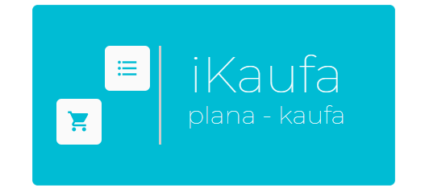

# SW-Praktikum-Gruppe-1-SS2020 - Shopping App "iKaufa"
Hochschule der Medien - Modul Software Praktikum (335138b) - Gruppe 1 - Sommersemester 2020

<p align="center">

<p>

## Contributors
[Pia Schmid](https://github.com/PiaSchmid)<br>
[Pascal Illg](https://github.com/pasillg)<br>
[Kevin Eberhardt](https://github.com/kevin-eberhardt)<br>
[Julius Jacobitz](https://github.com/JuliusJacobitz)<br>
[Christopher Böhm](https://github.com/christopherboehm1)<br>
[Niklas Denneler](https://github.com/niklasden)<br>


## Table of Contents
- [SW-Praktikum-Gruppe-1-SS2020 - Shopping App "iKaufa"](#sw-praktikum-gruppe-1-ss2020---shopping-app-ikaufa)
  - [Contributors](#contributors)
  - [Table of Contents](#table-of-contents)
- [Frontend - React ⚛️](#frontend---react-️)
- [Fake-HTTP-Backend - Just for development purposes](#fake-http-backend---just-for-development-purposes)
- [Backend - Python / Flask](#backend---python--flask)
- [Database - MySQL](#database---mysql)
- [Deployment - Google Cloud Plattform](#deployment---google-cloud-plattform)
  - [Deployment on Google Cloud - Backend](#deployment-on-google-cloud---backend)
  - [Deployment on Google Cloud - Frontend](#deployment-on-google-cloud---frontend)
  - [Deployment on Google Cloud - Frontend-Report](#deployment-on-google-cloud---frontend-report)
  - [Routing on Google Cloud](#routing-on-google-cloud)
  
# Frontend - React ⚛️
All code is located under /frontend. <br>
As advised per the project requirements we used React & Material-UI.<br>
Testing for the frontend is done via the fake-http-backend, until our "real" backend is finished.<br>
To run it install the packages inside the package.json, via your package manager of choice and run it.<br>
NodeJS comes with the Node Package Manager, which will install all missing dependenciesf from the package.json file<br>

```
cd /frontend 
npm install 
npm start
```

# Fake-HTTP-Backend - Just for development purposes
Files are located inside /http-fake-backend.
Install via your favourite package manager and run it afterwads.
It will expose a temporary HTTP Backend @ http://localhost:8081
To change the config see config.js.
To change add new routes / change current routes see the python-mockbackend-config.js inside under /server/api/

```
cd /frontend/http-fake-backend
npm install 
npm start
```

# Backend - Python / Flask
We advise you to set up a python virtual enviorment, to keep python clean. <br>
This codes is tested under python version 3.7 <br>
All code is located under /src. <br>
To run the application on your own device, clone the repo. <br>
Install the requirements inside requirements.txt & run the application by launching main.py <br>

```
cd /src
pip install -r requirements.txt     
python main.py    
```


# Database - MySQL
- MySQL Community Server 8.0.20:
    - Download the latest Community server for your OS from here https://dev.mysql.com/downloads/mysql/
    - Setup the database and import our database dump
- Google Cloud SQL:
    This requires the Google Cloud SDK & Google Cloud Proxy.
    See Google Documentation for install methods.
    Connection String for Proxy to get secure access to the Google Environment:
    ```
    ./cloud_sql_proxy -instances=sw-praktikum-gruppe-1-ss2020:europe-west3:swpraktikum-sql=tcp:3306
    ```
    This method will only work, if we assign you to the project team and grant you access.
- Docker:
    - This method obviously requires Docker and Docker-compose
    - Run the docker-compose up inside the /db directory. 
    - Connect to the phpmyadmin dashboard under your localhost and import the database dump
    - Change the connection parameter inside the src/mapper.py to fit your envoirnment

Depending on the configuration you chose, you need to update the connection string inside the mapper.py / ShoppingAPI.js  

# Deployment - Google Cloud Plattform
Our live version is hosted using the Google App Engine.
[http://ikaufa.com](http://ikaufa.com)

## Deployment on Google Cloud - Backend
Google App Engine Standard Envoirnment is on Python Version 3.7 <br>
Google Cloud SQL is on MySQL 5.7, access is provided via sqlconnector. <br>
<<<<<<< HEAD
See .yaml for extra config.
To update deployed version of python code see commands below.<br>
There is a connection between the Github Repo and the Google App Engine, which allows as to auto deploy the application. <br>
This happens everytime something new is being pushed to the deploy branch.<b>
=======
See .yaml for extra config. <br>/
Navigate to /src and run the command below<br>
Commands of use:
```
gcloud app deploy
```

## Deployment on Google Cloud - Frontend
Google App Engine Standard Envoirnment is on NodeJS Version 11 <br>
See .yaml file for extra config.
React requires an extra build step to generate static files for deployment, which are located in a seperate folder. <br>
This needs to be done after every change to the js files.
>>>>>>> master

To update deployed version of the fronentd code see commands below.<br>
Navigate to /frontend and run the commands below:
Commands of use:
```
npm run build
gcloud app deploy
```

## Deployment on Google Cloud - Frontend-Report
See deployment guide for Frontend.

## Routing on Google Cloud
We decided to use a micro service architecture with seperate services for all applications.<br>
This allows us to deploy changes to the services individually and we make use of the cloud native scaling capabilities Google provides us with.<br>
Using the dispatch.yaml we redirected routing to the services on a subdomain level.<br>
This results in the following 3 URLs:<br>

[http://www.ikaufa.com](http://ikaufa.com) (hosts main frontend)<br>
[http://www.backend.ikaufa.com](http://backend.ikaufa.com) (hosts backend)<br>
[http://www.report.ikaufa.com](http://report.ikaufa.com) (hosts report client)<br>